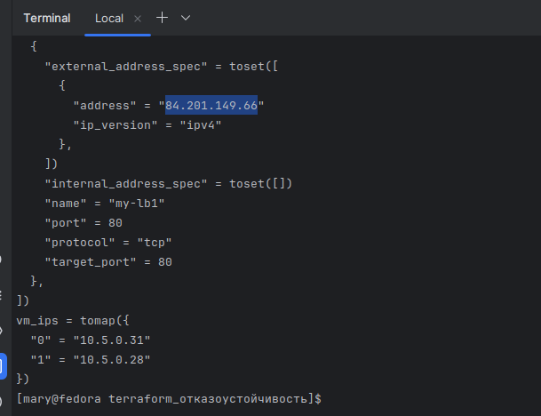
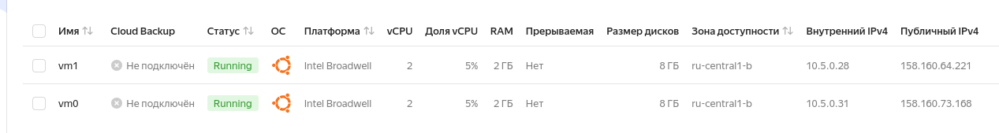
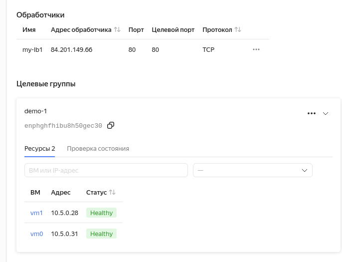
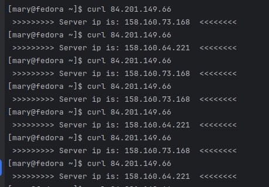

# Домашнее задание к занятию 4 "Отказоустойчивость в облаке" - Варфоломеева Марьяна

### Задание 1

В ходе выполнения задания был создан [terraform playbook](./main.tf), который:
 * создает 2 идентичные виртуальные машины с помощью аргумента count; 
 * создает таргет-группу и помещает в неё созданные на шаге 1 виртуальные машины;
 * создает сетевой балансировщик нагрузки, который слушает на порту 80, отправляет трафик на порт 80 виртуальных машин и http healthcheck на порт 80 виртуальных машин.

Также был написан [ansible-playbook](./nginx_setup.yml), который устанавливает nginx на сервер и копирует на него файл [nginx.conf](./nginx.conf) 

Для аутентификации в Яндекс-облаке в файл .bashrc была добавлена функция, которая добавляет в переменные окружения аутентификационные данные:
```
init_yc() {
    export YC_TOKEN=$(yc iam create-token)
    export YC_CLOUD_ID=$(yc config get cloud-id)
    export YC_FOLDER_ID=$(yc config get folder-id)
}

```
Теперь, чтобы добавить переменные окружения или обновить iam-токен, достаточно выполнить команду в терминале:
```
> init_yc
```

Для инициализации Terraform выполнить команду:
```
> terraform init
```
Для проверки выполняемых действий:
```
> terraform plan
```

Если ошибок нет, выполнить:
```
> terraform apply
```
После выполнения скрипта можно увидеть информацию о созданном балансировщике и виртуальных машинах:


ВМ в яндекс-консоли:



Балансировщик и таргеты:



Для установки nginx на ВМ выполнить:
```
> ansible-playbook nginx_setup.yml -u user -bi 158.160.64.221,158.160.73.168
```
После установки nginx можно проверить работу балансировщика. Видно, что при обращении к адресу балансировщика (84.201.149.66) происходит проброс то на один, то на другой сервер из таргет-группы:


